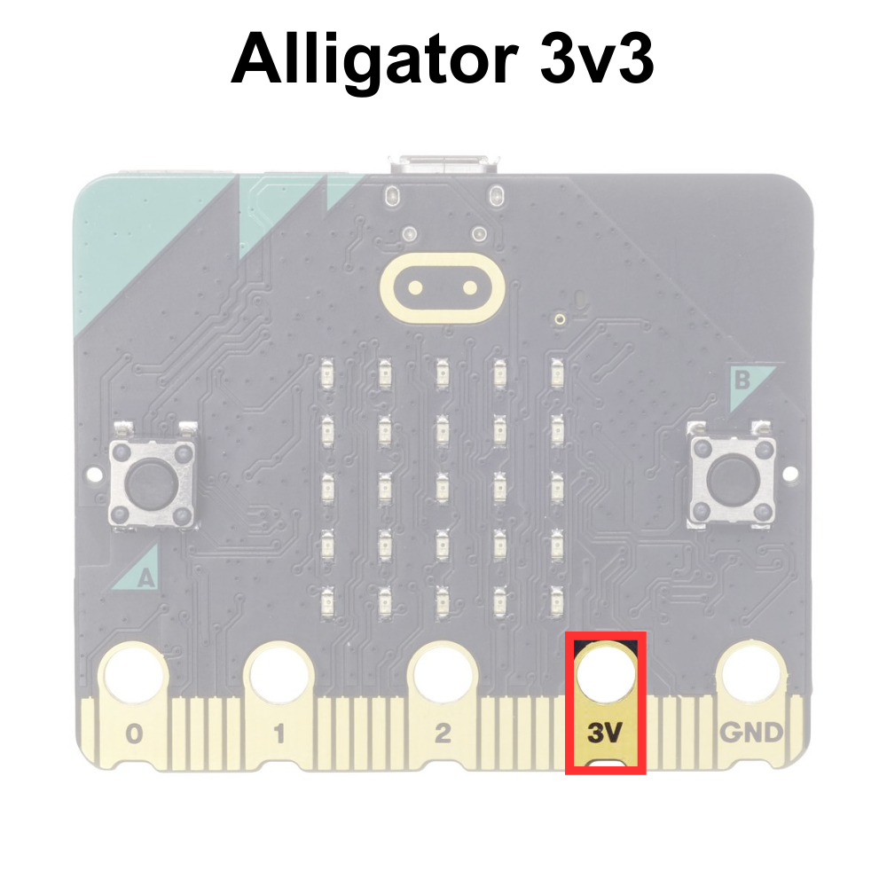
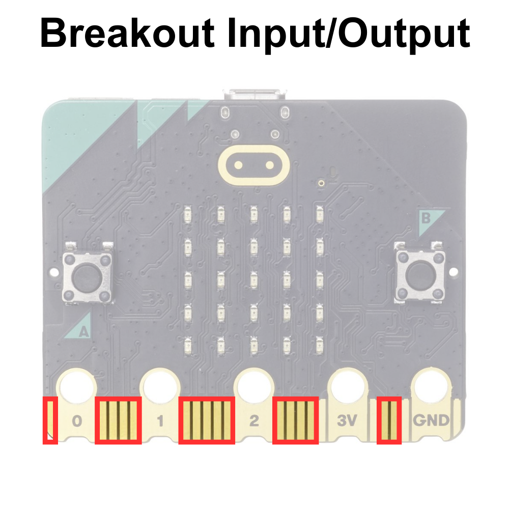
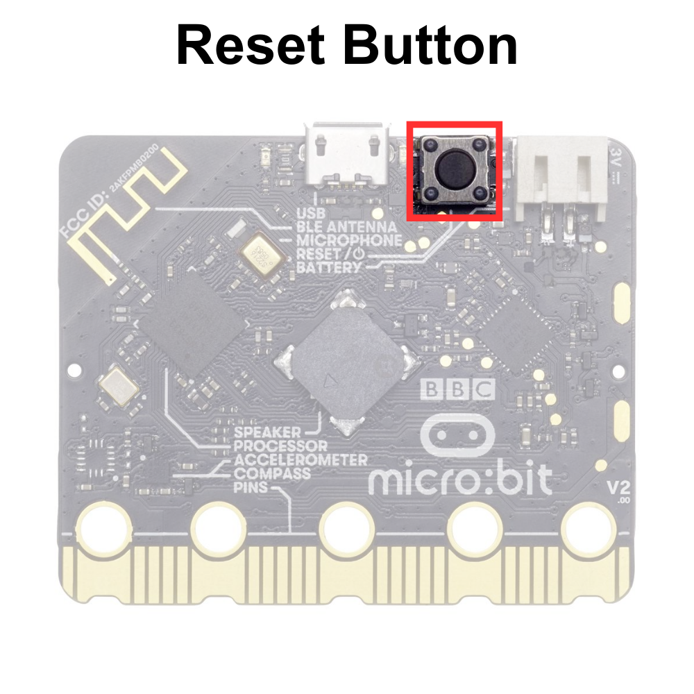

# Parts of the BBC micro:bit
The micro:bit has several components. Some of these components are programmable and can be directly controlled with MakeCode blocks. Other components are non-programmable, cannot be controlled in MakeCode, and work independently.

The programmable components are as follows:
- The 5×5 LED Matrix Display
- The General-Purpose Input/Output Pins (GPIO)
- The A and B Buttons
- The Sound Sensor/Microphone
- The Buzzer/Speaker
- The Accelerometer/Compass
- The Temperature Sensor
- The Captive Touch Buttons

The non-programmable components are as follows:
- The Processor
- The Bluetooth Antenna
- The Micro USB Connector
- The Power Connector
- The Reset Button

These components are explained in greater detail below:

---
## Programmable Components

As mentioned above, the micro:bit has many programmable components that can be directly controlled using MakeCode blocks. The programmable components are as follows:

---
### The 5×5 LED Matrix Display

The 5×5 LED Matrix consists of 25 individually controlable **light-emmitting diodes (LEDs)**. There are a series of blocks that allow the user to control the LEDs to display text and images.  

The 5×5 LED Matrix is displayed below:

---
### The General-Purpose Input/Output (GPIO) Pins

The **general-purpose input/output (GPIO)** pins are special connectors that let you interact with the outside world. Think of them like tiny switches that can send signals (like turning on a light) or receive signals (like reading the state of a button). You can program these pins to control various gadgets like LEDs, sensors, or motors. For example, you could write a program that makes an LED blink or measure temperature with a sensor. GPIO pins are useful for building projects and learning how electronics and sensors work. 

The GPIO pins are displayed below:

There are two types of GPIO pins on the micro:bit, alligator GPIO pins, and breakout board GPIO pins. The alligator GPIO pins can be accessed with alligator clips, as displayed below:

**TODO: INSERT PHOTO OF MICRO:BIT WITH ALLIGATOR CLIPS**

The breakout board GPIO pins are slip pins that cannot be accessed without a **breakout board**. 

---
#### Alligator GPIO Pins

The most accessible pins are designed with holes with alligator clips to easily attach wires to these pins without needing any special tools. These pins are labeled `0`, `1`, 2, `3V`, and `GND`. These labels help you know where to connect your wires when using alligator clips on these pins.

---
##### Alligator Input/Output Pins

The alligator clip GPIO pins labeled `0-2` on the micro:bit let you connect the micro:bit to other electronic components, like lights, motors, or sensors. These pins can send signals to control these components or receive signals to get information from them, helping you create projects and experiments.

---
##### Alligator 3v3 Pin

The alligator `3V` pin on the micro:bit provides a small amount of power, like a battery. You can use it to power other electronic components, like sensors or small lights, in your projects. This pin helps ensure your connected devices have the energy they need to work.

---
##### Alligator GND Pin

The pin labeled `GND` is the ground pin. This pin is necessary to complete a circuit. (This will be covered more in detail in Lessons 3-5)

**TODO:MAKE SURE LESSONS MENTIONED ABOVE ARE CORRECT**

---
#### Breakout Board GPIO Pins

The other pins that are not labeled are only easily accessible using breakout boards specifically designed for the micro:bit. Some basic breakout boards available for micro:bit are displayed below:

Some breakout boards are designed to work with components that have special connectors and some breakout boards are designed to work with breadboards (the breakout boards on the left).

---
##### Breakout Board Input/Output Pins

**TODO: EXPLAIN THE PINS**

---
##### Breakout Board 3v3 Pins

**TODO: EXPLAIN THE PINS**

---
##### Breakout Board GND Pins

**TODO: EXPLAIN THE PINS**

---
###  The A and B Buttons

The A and B buttons on the micro:bit are like simple controls that you can press to interact with your programs. You can program the micro:bit to do different things when you press these buttons, like showing a message on the LED screen, playing a sound, or starting a game.

---
### The Sound Sensor/Microphone

The sound sensor/microphone on the micro:bit can sense sounds around it. It allows the micro:bit to detect noises, like clapping or talking, and then respond to them in your programs. For example, you could make the micro:bit light up when it hears a loud sound.

---
### The Buzzer/Speaker

The buzzer/speaker on the micro:bit can play sounds and music. You can program the micro:bit to make noises, play melodies, or create sound effects, which can be useful for games, alarms, or fun projects.

---
### Accelerometer/Compass

The **accelerometer** on the micro:bit senses movement and can tell how fast and in which direction the micro:bit is moving. The compass, also called a **magnetometer**, detects the Earth’s magnetic field and helps the micro:bit know which way is north. Together, these sensors can be used for activities like making a step counter or a digital compass.

---
### Temperature Sensor

The micro: bit's temperature sensor measures how hot or cold it is around the device. It’s built into the **processor** (the micro:bit's brain), so it can quickly read temperature information, which can then use this data to display the temperature on the LED screen or respond to changes in temperature in your programs. This temperature sensor is accurate between ±4°C.

---
### The Captive Touch Inputs

TODO

---
#### The Captive Touch Logo

The capacitive touch logo on the micro:bit works like a touch-sensitive button. When you touch the logo, it can detect your touch and send a signal to the micro:bit’s processor, allowing you to interact with your programs in a fun and easy way, like turning on lights or starting a game. 

---
#### The Captive Touch Pins

The capacitive touch pins on the micro:bit are touch-sensitive spots, similar to the logo. When you touch these pins, they can detect your touch and send a signal to the micro:bit’s processor. This lets you interact with your programs in different ways, like controlling lights or sounds by simply touching the pins.

---
#### The Captive Touch GND

To use the capacitive touch logo and pins on the BBC micro:bit, you need to connect the GND pin to something that you are touching, like holding a wire connected to it. This helps the micro:bit detect your touch more accurately because it completes the electrical circuit needed for the touch sensors to work properly.

---
### The Bluetooth Antenna

The BLE antenna micro:bit allows it to communicate wirelessly with other devices using Bluetooth. This means the micro:bit can send and receive information, like messages or sensor data, to and from phones, tablets, and other micro:bits without using any cables.

---
## Non-Programmable Components

There are sever

---
### The Processor

The processor on the micro:bit is like the brain of the device. It reads the instructions from your program and tells the micro:bit what to do, such as lighting up LEDs, reading sensors, or playing sounds. Without the processor, the micro:bit wouldn’t be able to follow any commands.

---
### The Micro USB Connector

The USB connector on the micro:bit lets you connect it to a computer using a USB cable. This connection allows you to transfer programs from your computer to the micro:bit and also powers the micro:bit so it can run those programs.

---
### The Power Connector

The power connector on the micro:bit is where you plug in a power source, like a battery pack or a USB cable. This power source gives the micro:bit the energy it needs to run your programs when it is not connected to the computer with a USC cord. Without power, the micro:bit can’t do anything.

---
### The Reset Button

The reset button on the micro:bit is like a restart button on a computer. When you press it, the micro:bit stops whatever it’s doing and starts over from the beginning, running the program you loaded onto it from the start. This is useful if your program gets stuck or if you want to quickly restart it without turning the whole device off and on.

