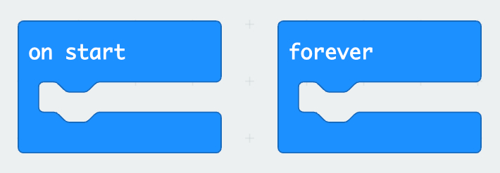

# `on start` and `forever` Blocks

## What is a Loop?

Two blocks are loaded by default when you open a new project in MakeCode, the `on start` and `forever` blocks. These blocks are displayed below:

Together, these blocks help you manage how your micro:bit behaves when it starts and during its operation. The differences between these blocks are explained below:

### `on start` Blocks

The `on start` block contains code that runs once, right when you turn on or reset your micro:bit. It’s perfect for setting things up, like displaying a welcome message or setting initial values. 

### `forever` Blocks

The `forever` block, on the other hand, contains code that runs repeatedly in a **loop** as long as the micro:bit is on. This is great for tasks that need to keep happening, like blinking an LED or checking if a button is pressed. 
