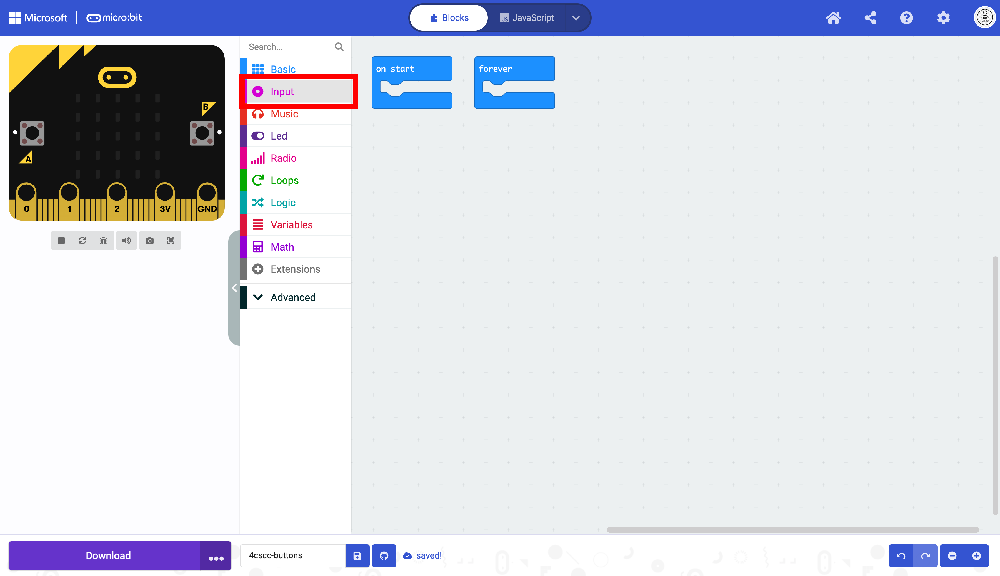
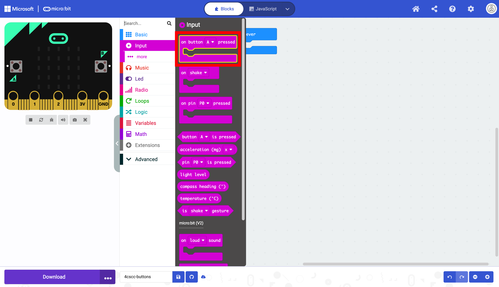
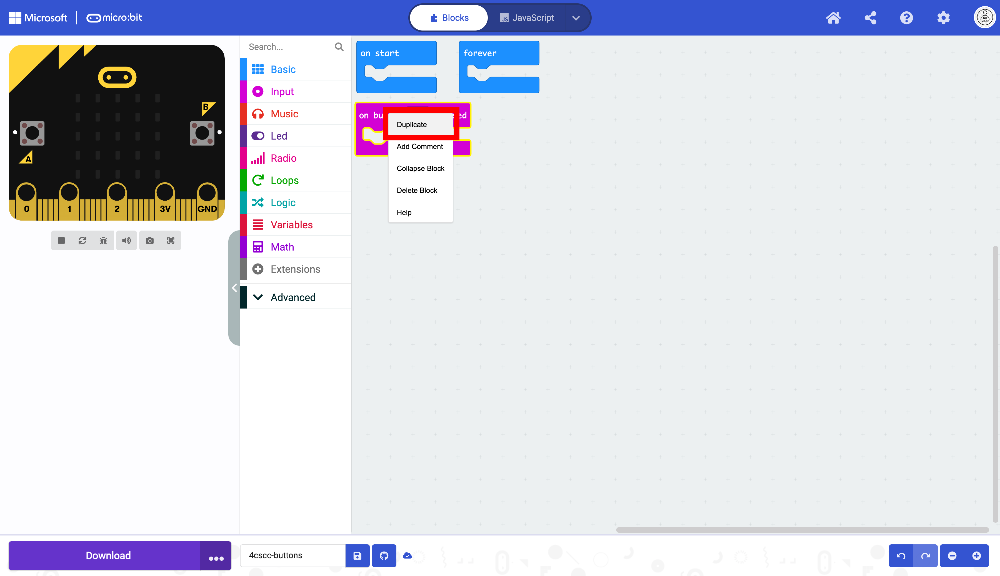
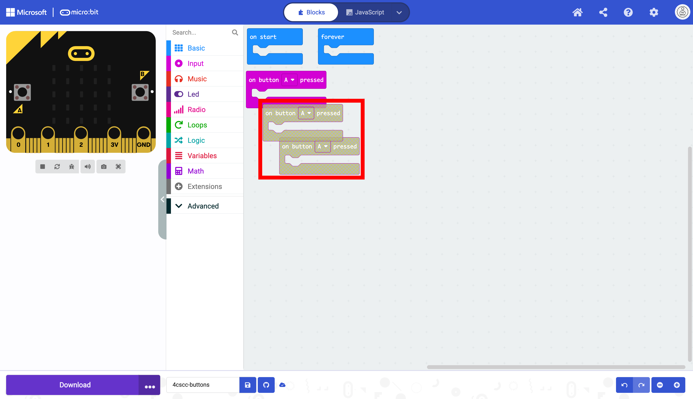
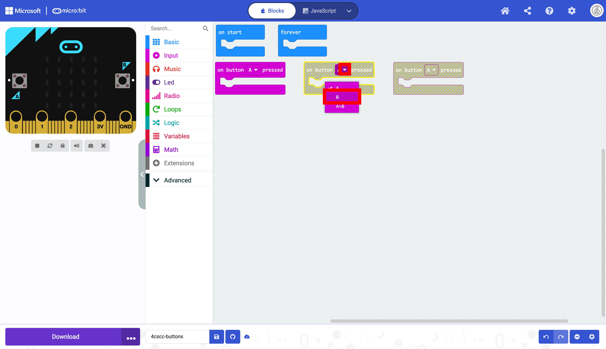
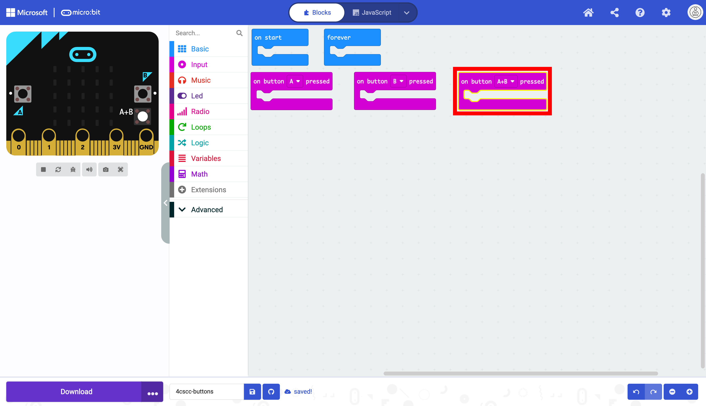
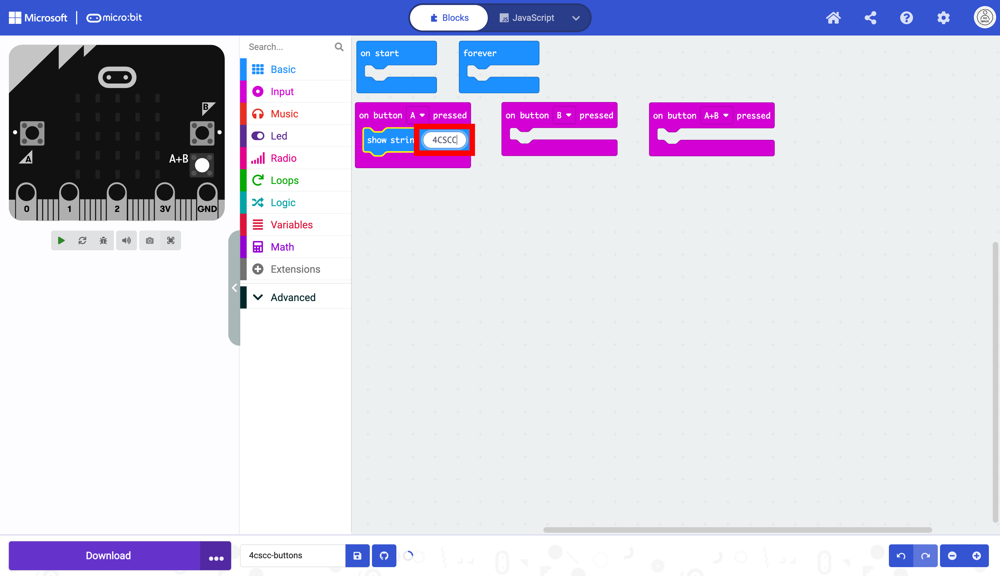
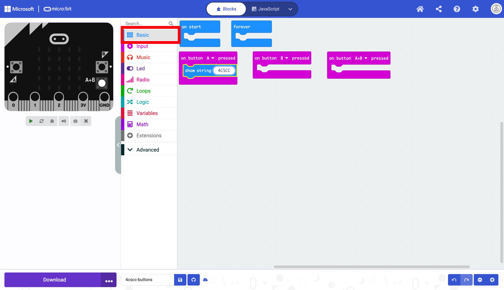
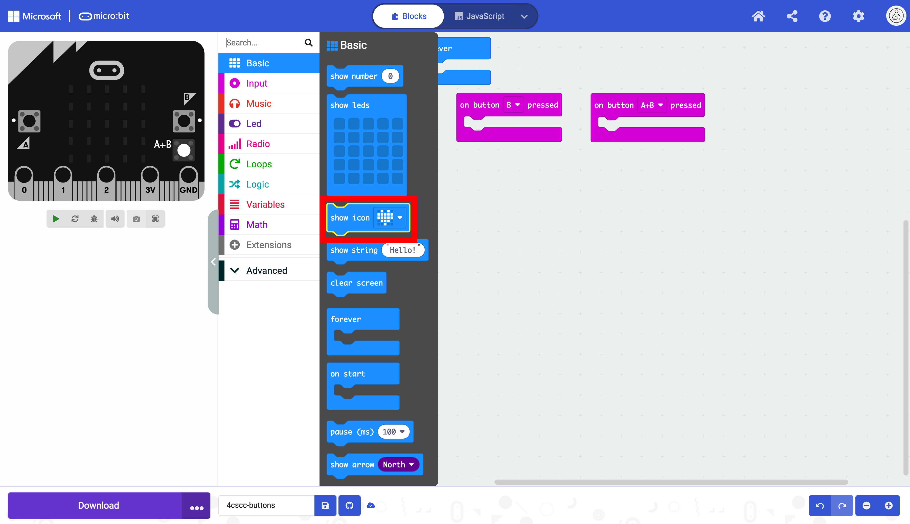

# Using the A and B Buttons

In this section, we will focus on the A and B buttons:

To access the code for the buttons, click on the "Input" drawer of the Toolbox.

Select an `on button` block.

Place the `on button` block on the workspace. This block has three options: `A`, `B` and `A + B`. The `A + B` is when you press both the A and B button at the same time.

Duplicate the `on button` block twice.

These blocks are not the same color as the other block, because they are the same. This means that they will be ignored unless you change the values in the dropdown menu.

Rearrange the blocks to make the workspace cleaner.

Click on the arrow on the dropdown menu on one of the duplicated blocks and change the value to `B`.

The block changes colors and wilpl not be ignored.

Click on the arrow on the dropdown menu on the remaining duplicated block and change the value to `A + B`.

This block changes colors too, and will not be ignored.

Now we need to do something when the buttons are pressed. Click on the "Basic" drawer in the Toolbox.

Select a `show string` block.

Place the `show string` block in any of the `on button` blocks.

Change the string to display a string of your choice. In this example,  the string "4CSCC" will be displayed on the micro:bit display when button A is pressed.

We will work on another block now. Click on the "Basic" drawer again.

Select a `show icon` block.

Place the show icon block in any of the empty `on button` blocks.

Change the image using the dropdown menu.

In this example, the happy face icon will display when button B is pressed.

You need one more action for your remaining block. Click on the "Basic" drawer in the Toolbox again.

This time we will display a custom image. Choose the `show leds` block.

Place the `show leds` block in the remaining block. In this example the custom image will be displayed when buttons A and B are pressed at the same time.

Design your custom image.

The code is now ready to be flashed on the micro:bit.

