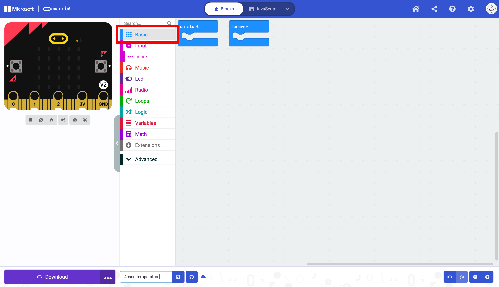
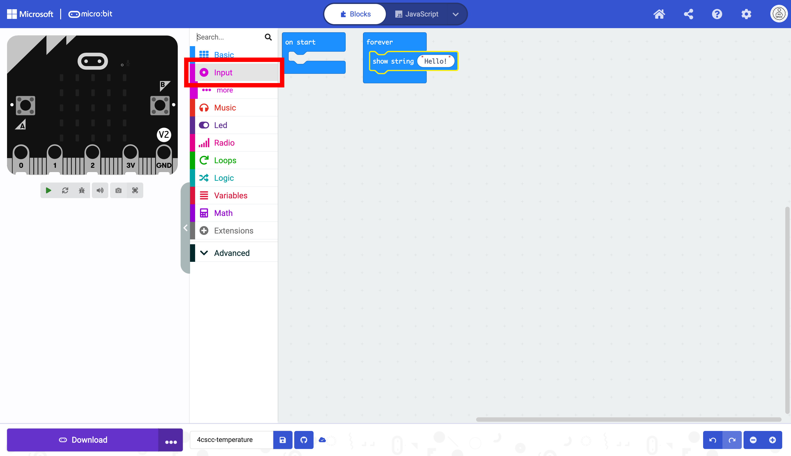

# Using the Temperature Sensor
This section focuses on the onboard temperature sensor. As mentioned previously, this sensor is not a dedicated temperature sensor; it is attached to the processor. It is also not as accurate as the temperature sensors used in later sections of this manual.

To display the temperature, we first need to add a string representing the value returned by the sensor. To do so, click on the "Basic" drawer in the Toolbox.

Select the `show string` block.

Place the `show string` block in the `forever` block.

Next, we need to get the block that reads the temperature. To do so, click on the "Input" drawer of the Toolbox.

Select the `temperature (°C)` block.

Place the `temperature (°C)` block in the `show string` block. 

The micro:bit is now ready to be flashed with code. Press the download button to transfer the code to the micro:bit.
