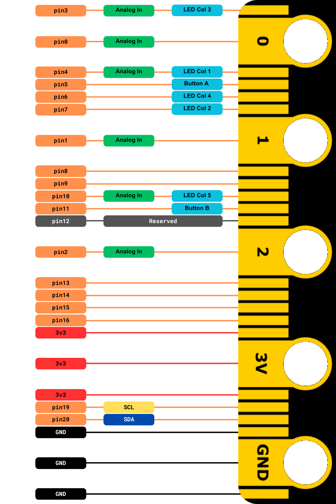

# General-Purpose Input/Output GPIO Pins

## What are General-Purpose Input/Output Pins?

**General-purpose input/output (GPIO) pins**, are small connection points on a device like the BBC micro:bit. They let you connect the micro:bit to other electronic components, like sensors, lights, or motors. These pins can either send signals to control these components or receive signals to get information from them, making your projects more interactive and fun.

The micro:bit has 19 assignable GPIO pins. These pins can be used as **inputs** for different switches and sensors. They can also control **outputs** like light-emitting diodes (LEDs), displays, buzzers, and motors. Some pins are designed to work with alligator clip leads, but others require breakout boards to access the pins. The **pinout** describing the main functions and alternative functions for the micro:bit is displayed below:

Notice how many pins have many functions. GPIO pins 3, 4, 6, 7, and 10 are shared with the LED matrix display. Buttons A and B are also connected to GPIO pins 5 and 11. Pin 12 is not programmable. In this lesson, we will learn to connect the GPIO pins to a breadboard using the Kitronik prototyping plate breakout board.
