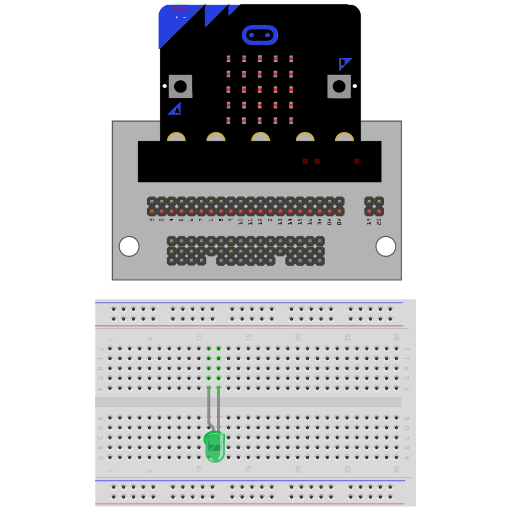

# Building a Simple LED Circuit

Insert the micro:bit into  the Kitronik breakout board.


Insert the LED into the breadboard. 

- **Make sure that the LED and the cathode are not on the same row on the breadboard. **
- **Take note of which lead is the anode.**

```{tip}
Choose a side that the LED lead will always be facing (right or left). This helps prevent incomplete circuits and makes it easier to remember which lead is the anode and which lead is the cathode. 
```



Attach a resistor to the row with the cathode lead of the LED.

```{note}
The resistor can be attached to either the anode or the cathode in an LED circuit. Pick one lead (either anode or cathode) and attach it to that lead every time an LED circuit is built. 
```


Place a jumper wire from `0` on the breakout board to the row with the anode.


Place a jumper wire `0V` (the ground pin) on the breakout board to the row with the cathode.


The circuit is complete.


## Troubleshooting the LED Circuit

If the LED is not illuminating when you run the code:

- Check that the anode and cathode leads are not on the same row on the breadboard.
- Check that the GPIO pin is the correct GPIO pin in the code.
- Check that the GPIO pin is connected to the anode.
- Check that the cathode is connected to  the `0V` pin.