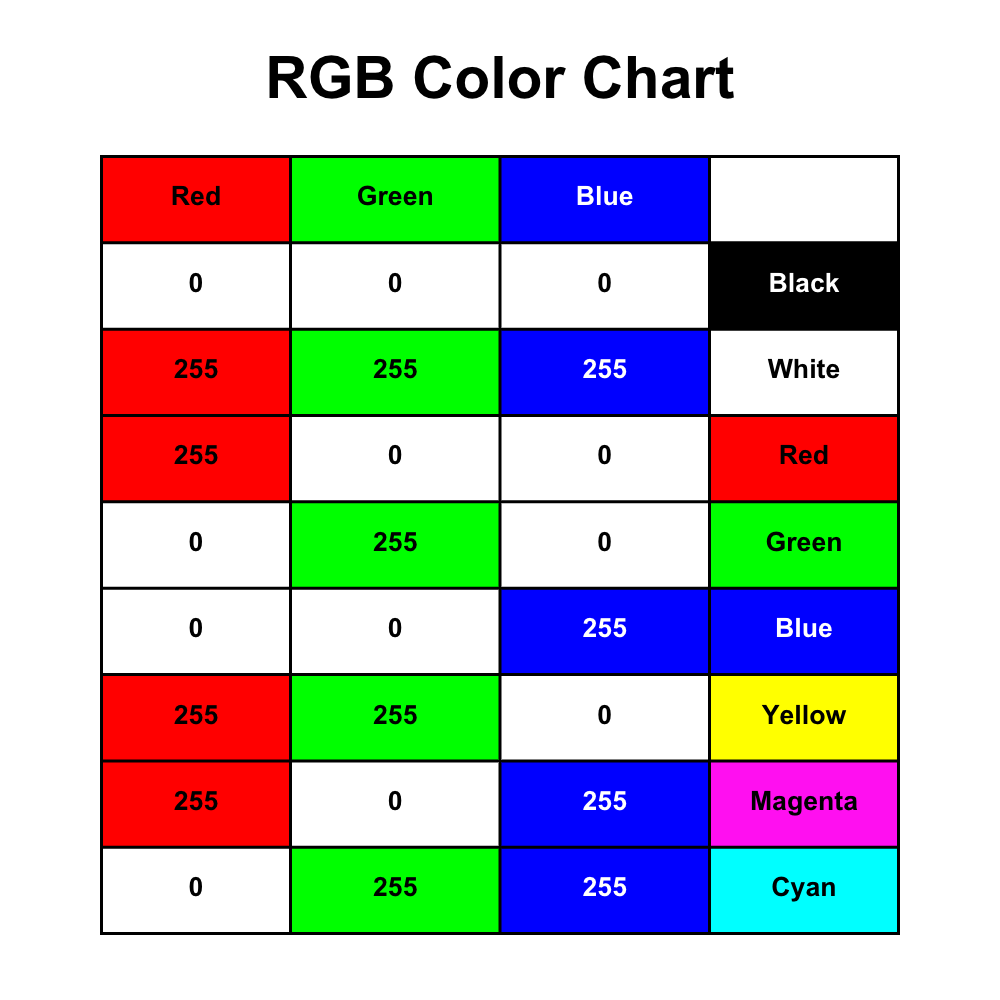

# RGB Color Codes (Part 2)

In the previous section about RGB Color Codes, we covered the colors red, green, and blue. An RGB LED can create many more colors. Below is a chart displaying the possible combinations with all three colors using the values `0` and `255`.

The Venn diagram below simulates how the colors mix to create these colors. The only values not represented above are (0, 0, 0). These are the values to turn the RGB LED off.

The colors are presented below in tabular form:

| Color       | (R, G, B) Values |
| ----------- | ---------------- |
| Red         | (255, 0, 0)      |
| Green       | (0, 255, 0)      |
| Blue        | (0, 0, 255)      |
| Magenta     | (255, 0, 255)    |
| Yellow      | (255, 255, 0)    |
| Cyan        | (0, 255, 255)    |
| White       | (255, 255, 255)  |
| Black (Off) | (0, 0, 0)        |

