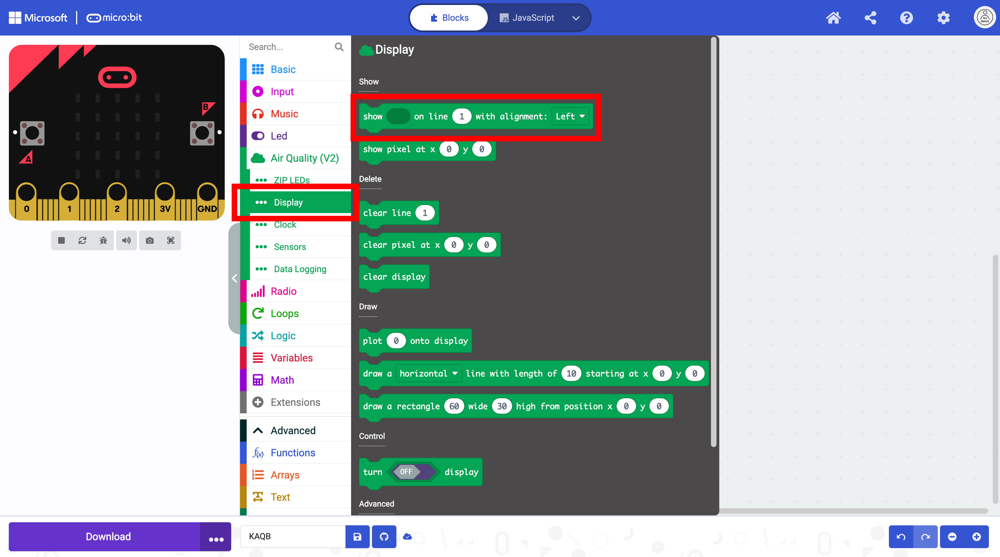
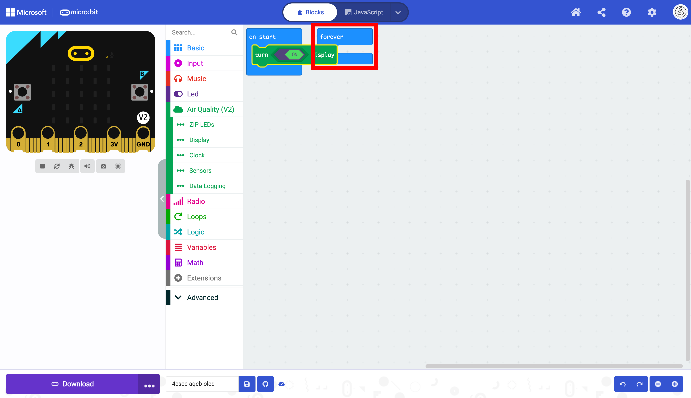
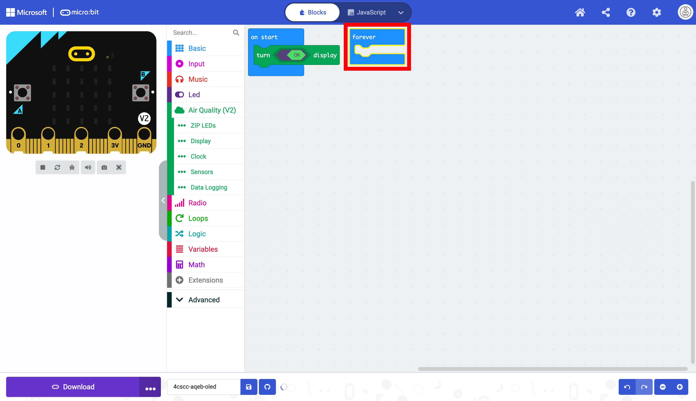
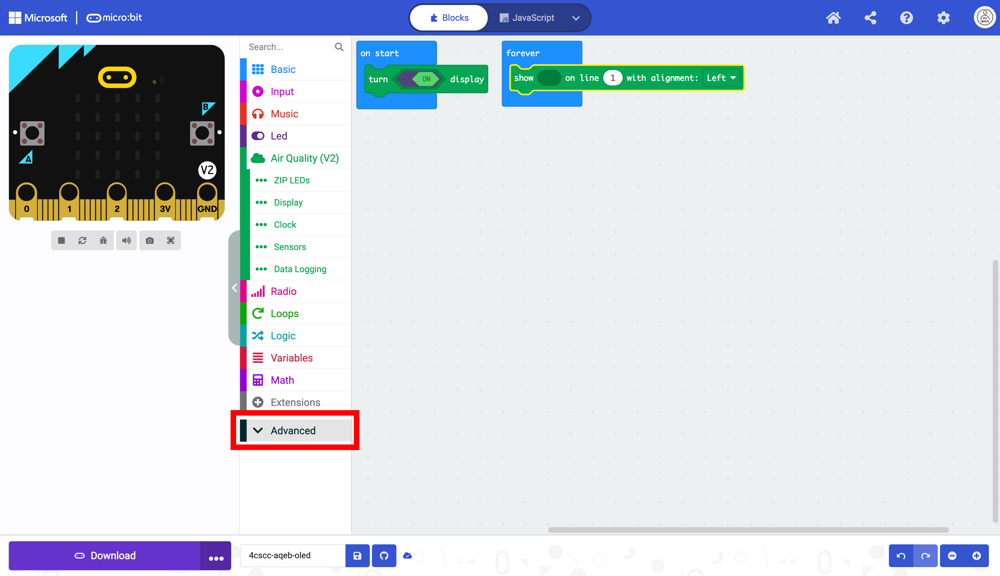
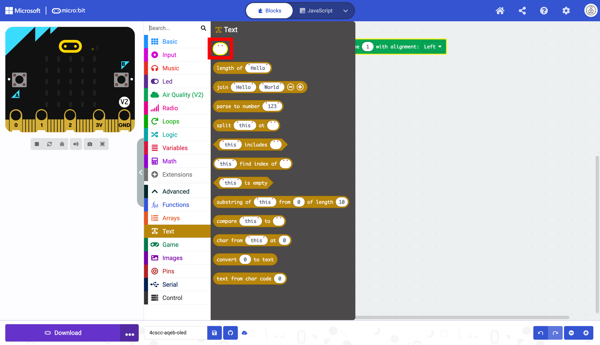
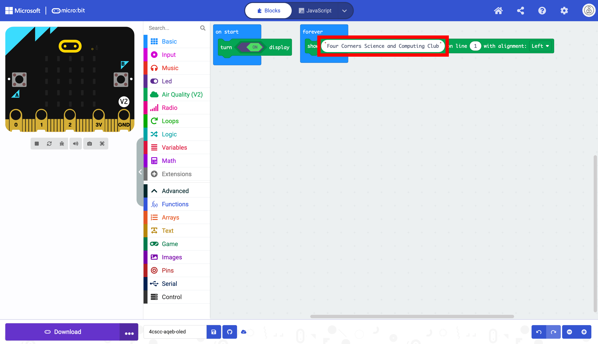
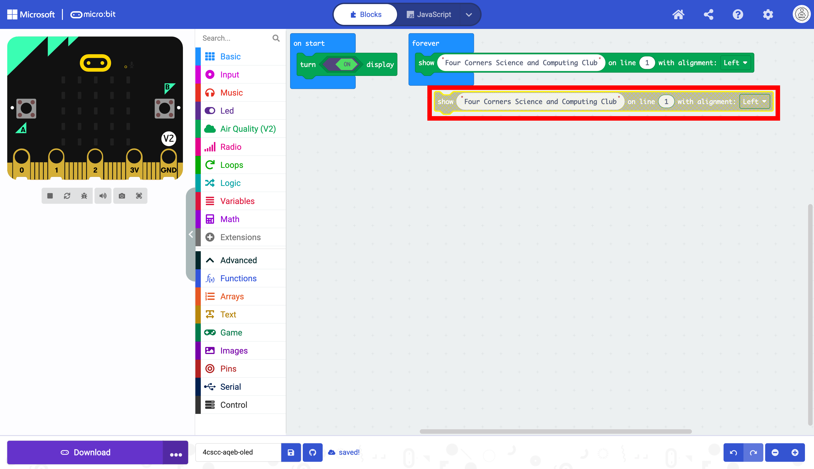
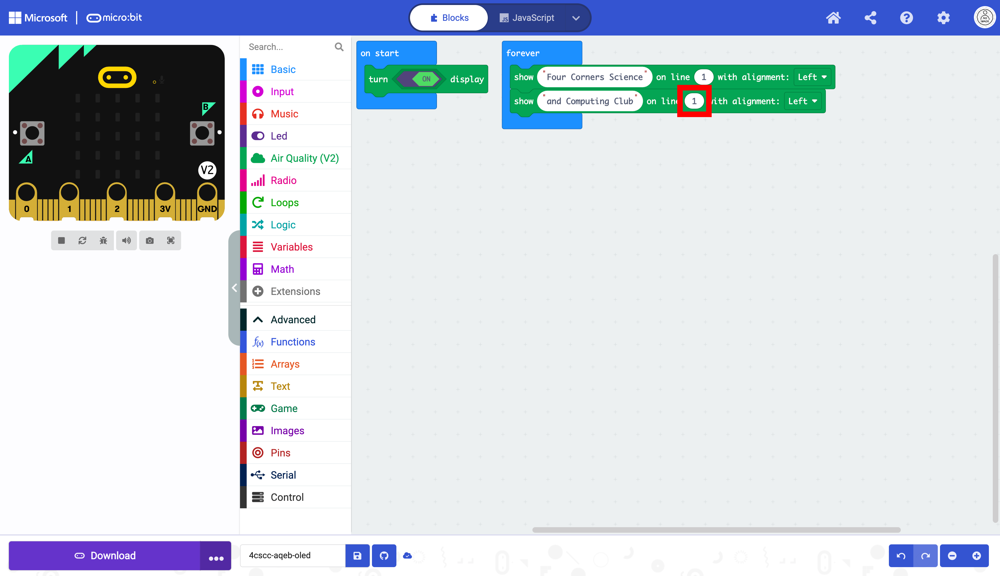
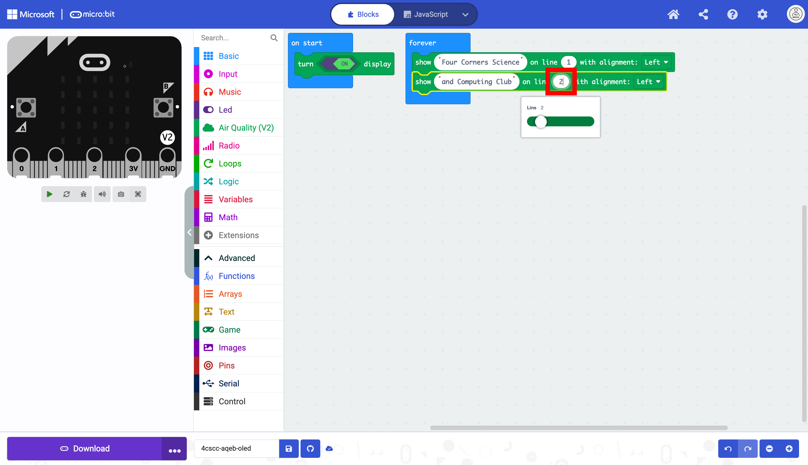

# Using the OLED Display

## What is an OLED Display?

An OLED display is a type of screen used in many devices, such as phones and TVs. What makes OLED special is that each pixel on the screen can emit its own light, unlike older screens, where a separate backlight is needed. This makes OLED displays bright and colorful, with deep blacks and vibrant colors. They also use less power, which helps devices last longer between charges. Overall, OLED displays give us clearer and more colorful images on our devices.

---

## Using the OLED Display on the Kitronik Air Quality and Environmental Board

For the display to function, the display must be turned on using the `turn off/on display` block.

Drag the `turn off/on display` into the `on start` block. This code needs to only run once at the beginning of the program.

 Toggle the `off/on` switch in the block,

The display has been initialized, and it can be used.

Notice that the `forever` block is behind the block inside of the `on start` block

Move the forever block to make it visible. You may rearrange blocks at any time. The blocks do not run in the order that they are displayed. 

Select the `show < > on line <1> with alignment` block. This is the block that displays text on the OLED screen. The blank oval will be the number or string that will be displayed. The second oval with a default `1` is the line number. The OLED can display up to eight lines on the OLED screen.

Drag this block into the `forever` block. As mentioned before, this block will run the code in a loop, which is what you need to display sensor data in real-time. Next select the `Advanced` drawer in the Toolbox.

Select `Text`. This section is where the blocks for strings are.

Select the empty string block.

Drag the empty string block into the first oval.

Type "Fout Corners Science and Computing Club" in the empty string block. Run the code on the micro:bit.

Notice how the text runs to the next line.

TODO: ADD PHOTO OF THE OUTPUT

When the text runs to the next line, the micro:bit does not understand word boundaries. Part of a word may be at the end of the line, and the remaining part will be on the next line. It is probably best to break up longer strings into multiple lines. Duplicate the existing block. Duplicating blocks is often faster than searching for the block again in the Toolbox.

Drag the duplicate directly below the other block.

Now that the block is below the next block, you can now have two lines of text.

The text is the same, and must be changed.

Modify the text so "Four Corners Science and Computing Club" is displayed on two lines.

Notice that the line number is still one. This must be changed or only one line of text will be displayed.

Change the line `1` to line `2`. 

The text is now displayed on two lines.

<iframe style="position:absolute;top:0;left:0;width:100%;height:100%;" src="https://makecode.microbit.org/#pub:S42841-02102-50736-79156" frameborder="0" sandbox="allow-popups allow-forms allow-scripts allow-same-origin"></iframe>

TODO: ADD PHOTO OF THE NEW OUTPUT

