# Measuring the Air Quality Index and Equivalent Carbon Dioxide

## What is the Air Quality Index?

The Air Quality Index (AQI) is a way to measure how clean or polluted the air is in a specific place. It uses numbers and colors to show how safe the air is to breathe. Lower numbers mean the air is cleaner and healthier, while higher numbers mean there are more pollutants in the air that could be harmful, especially for people with breathing problems like asthma. The AQI helps us know when it's okay to be outside or if we should stay indoors to protect our health.

---

## What is Equivalent Carbon Dioxide?

Equivalent carbon dioxide (eCO2), is a measure of the total impact of various greenhouse gases, like methane and nitrous oxide, expressed as an amount of carbon dioxide (CO2) that would have the same effect on global warming. Scientists use eCO2 to help understand how much these gases contribute to climate change and compare their effects more easily. By looking at eCO2 levels, we can better understand and track the overall impact of different activities and industries on the environment.

---

## Measuring Air Quality Index (AQI) with the micro:bit and Kitronik Air Quality and Environmental Board

As in the previous lesson we have to initialize the display. Select the "Display" drawer in the Toolbox. 

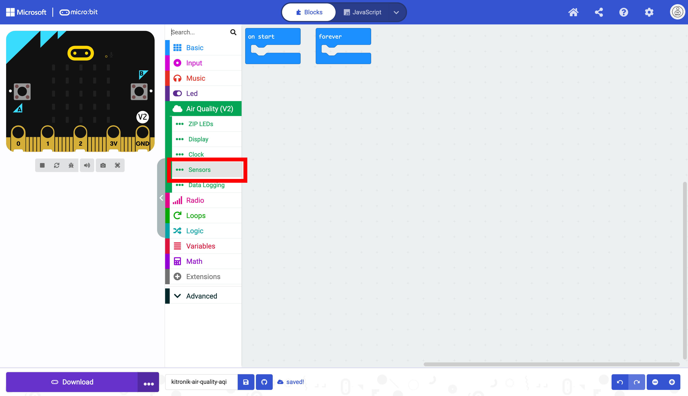

Select the `turn off/on display` block.

Drag the block into the `forever` block

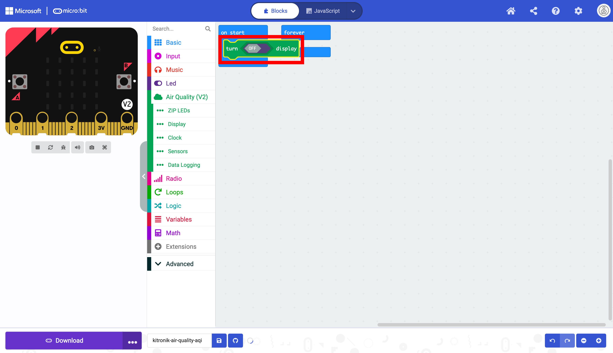

 Toggle the `off/on` switch in the block.

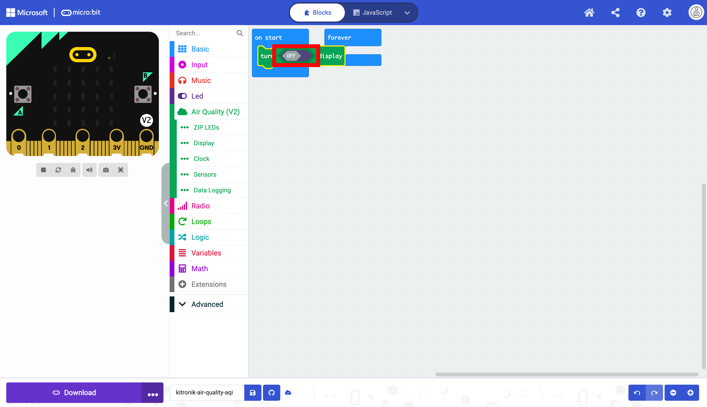

The display has been initialized and can be used.

Move the `forever` block.

It is now visible without obstruction.

Select the "Sensor" drawer.

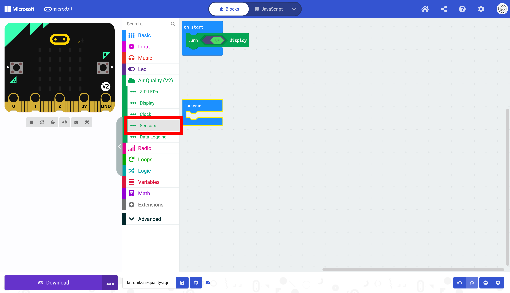

Here you can find the `establish gas baseline & ambient temperature` and `setup gas sensor` blocks. These blocks help the sensors gather more accurate air quality data.

Drag the `setup gas sensor` and `establish gas baseline & ambient temperature` blocks into the `on start` block. This only needs to run once at the beginning of the program.

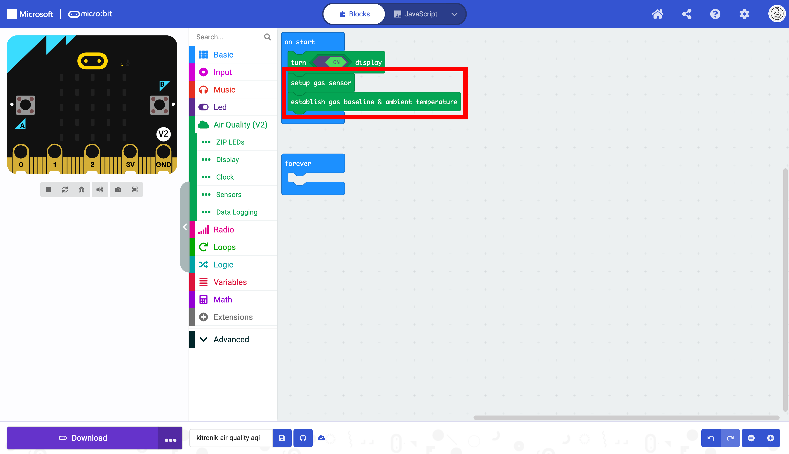

Select the `measure all data readings` block.

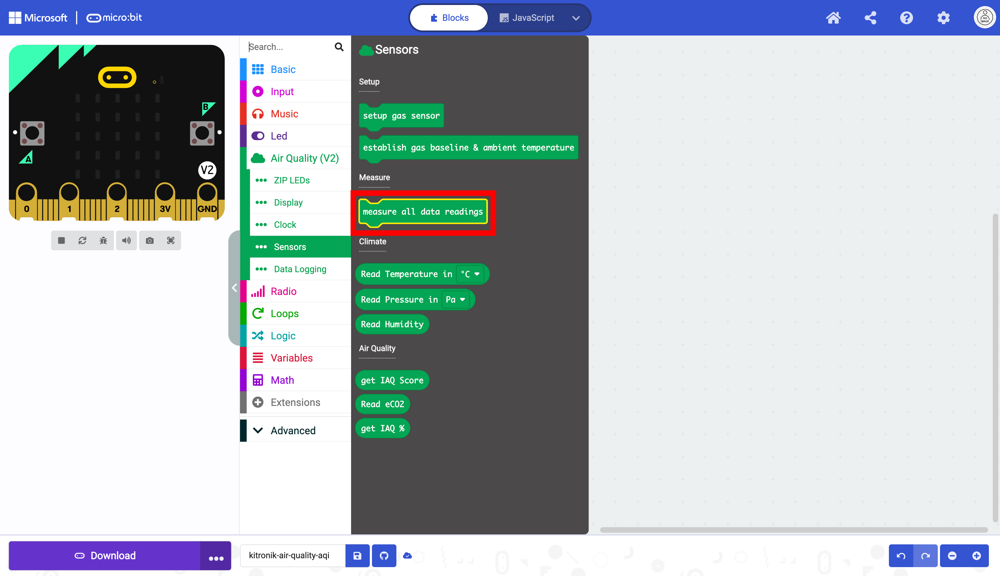

Place the block into the `forever` block. This will allow the micro:bit to record data in a loop. If this block is placed in the `on start` block, it will only run once. The data will not be updated continuously.

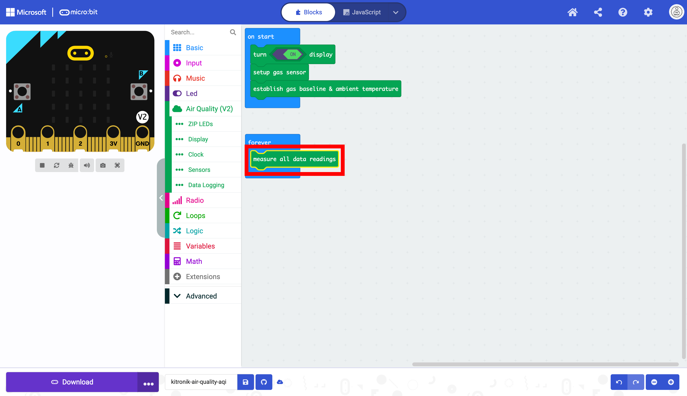

Select the "Display" drawer to access the blocks for the OLED display. 

Select the block that displays text on the OLED screen.

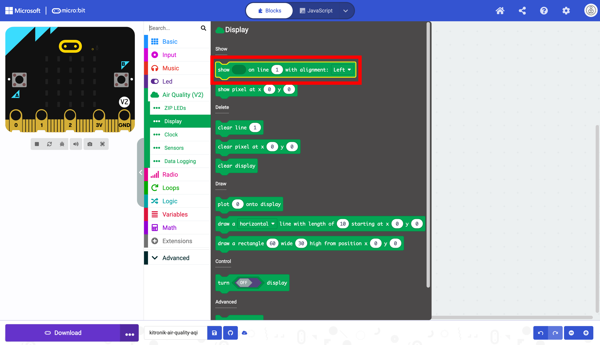

Drag the block into the forever loop below the other block.

Select the "Text" drawer in "Advanced" drawer in the Toolbox.

Select the `join` block. 

Place the block in the first oval that holds strings.

Clear the text in the two ovals to create empty strings.

Duplicate the box that displays text once.

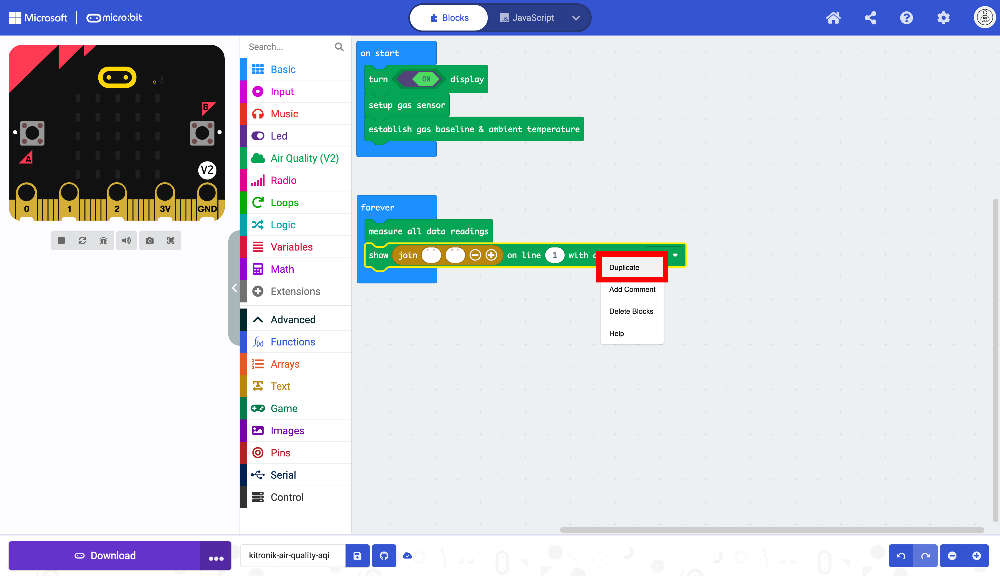

Select the duplicated block.

Place the block in the `forever` block below the other block as displayed below:

The data the micro:bit we will be reading is AQI score and the eCO2 level. The eCO2 level is measured in parts per million (ppm). 

The data will need to be represented as two separate strings for the AQI and three separate strings for the eCO2.

| Sting 1          | String 2    | String 3 |
| ---------------- | ----------- | -------- |
| `"AQI Score : "` | `aq1_data`  | NONE     |
| `"eCO2: "`       | `ec02_data` | `" ppm"` |

This will require a third string for the eCO2 only. Add another sting box with the `+` button.

The third string is now available.

Enter the data as determined above. Make sure to enter the whitespace. These spaces are necessary to have the Data display correctly. 

| String 1         | String 2    | String 3 |
| ---------------- | ----------- | -------- |
| `"AQI Score : "` | `aqi_data`  | NONE     |
| `"eCO2: "`       | `ec02_data` | `"       |

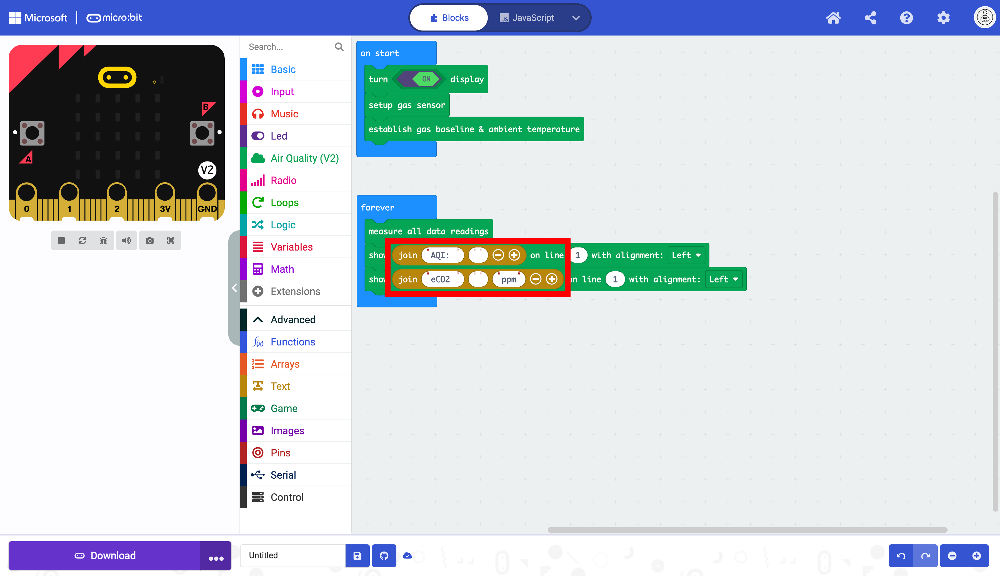

Select the "Sensor" drawer.

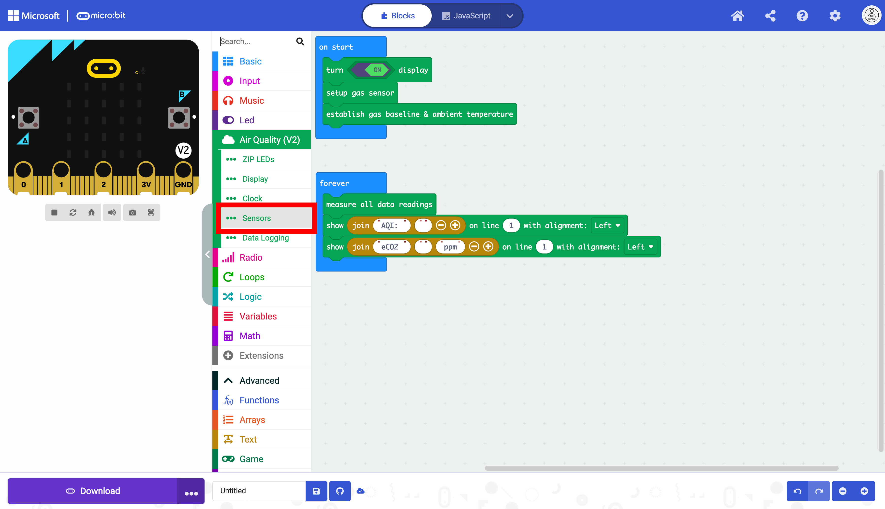

Select the `get IAQ Score`,  and `Read eCO2` blocks 

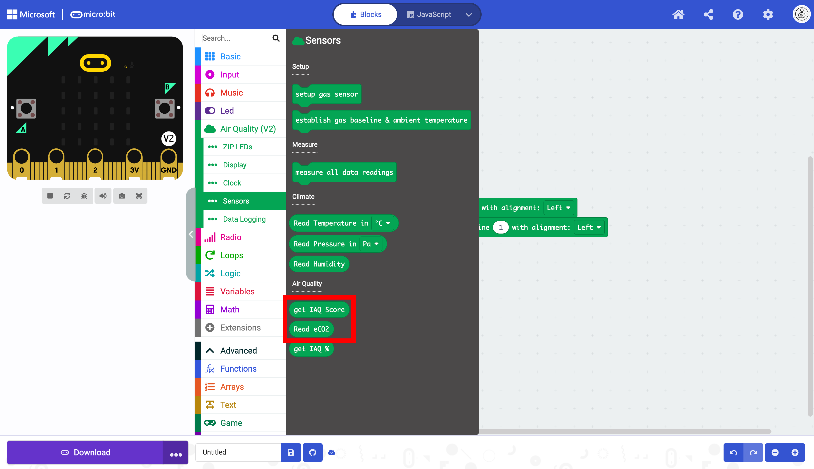

Place them in the corresponding text fields.

The code, as it is, will output the text for both measurements on the first line with only one visible

Change the line number to `2` .

The code is almost complete. The only thing needed now is a `pause` block. This will help give a more accurate reading from the sensors. Select the `Basic` drawer in the Toolbox.

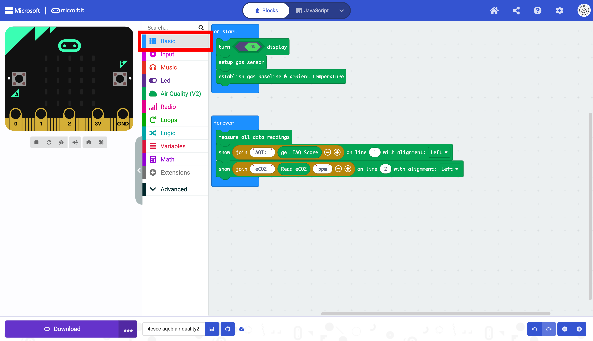

Select the `pause` block.

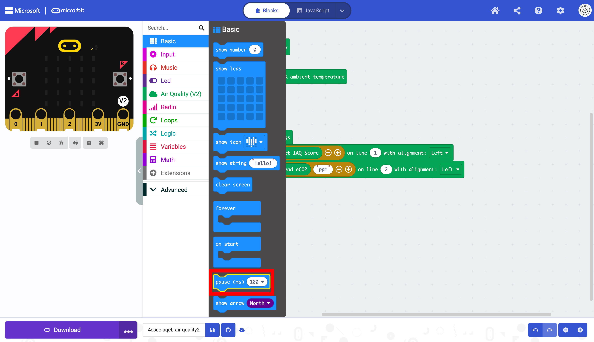

Drag the `pause` block to the end of the code blocks in the `forever` block.

Click on the triangle drop down button.

Select 5 seconds.

The `pause` block uses milliseconds (ms) and 5 seconds is 5000 miliseconds.

The code is now ready to be flashed on the micro:bit.

<iframe style="position:absolute;top:0;left:0;width:100%;height:100%;" src="https://makecode.microbit.org/#pub:S91222-97206-38819-26043" frameborder="0" sandbox="allow-popups allow-forms allow-scripts allow-same-origin"></iframe>
