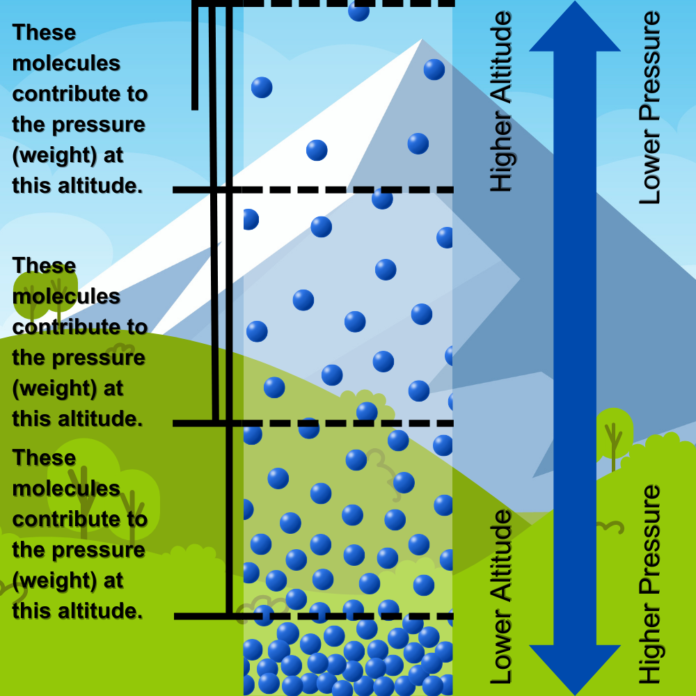

# Measuring Atmospheric Pressure

## What is Atmospheric Pressure?

Atmospheric pressure is the weight of the air pushing down on us and everything around us. It's like the pressure you feel when you dive deep underwater. This pressure comes from the huge blanket of air, called the atmosphere, that surrounds the Earth. Atmospheric pressure changes with the weather and altitude. It's important for predicting weather patterns because high pressure usually means clear skies, while low pressure often brings clouds and rain.

