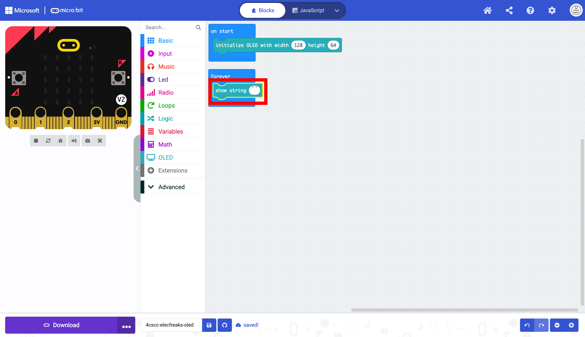
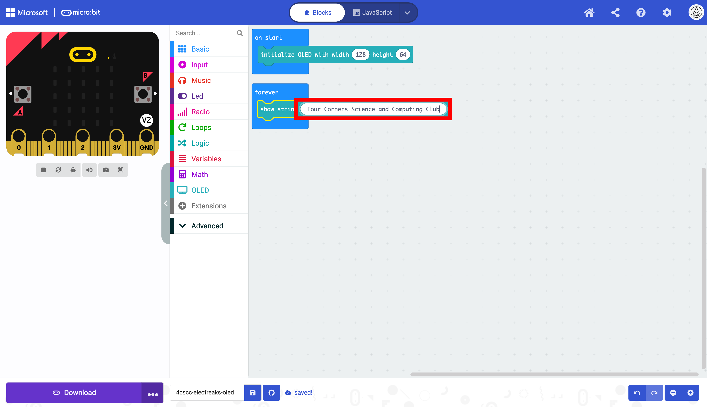
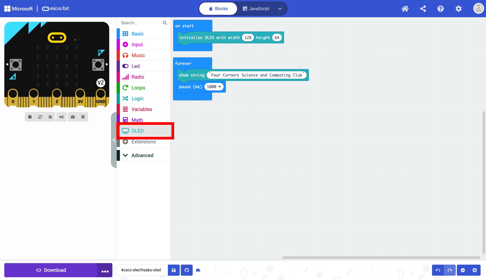

# Working with OLED

Click on the "OLED" drawer in the Toolbox.

Select the `initialize OLED` block. 

Place the `initialize OLED` block in the `on start` block. This only needs to run once. **Do not change the dimensions.**

The `forever` block can be moved.

It is now unobstructed.

Click on the "OLED" drawer of the Toolbox.

Select the `show string` block.

Place the `show string` block in the `forever` block.

Change the string in the `show string` block. Run the code. 

Notice how the block repeats the string again and again. To prevent this we will first add a delay. Click on the "Basic" drawer of the Toolbox.

Select the `pause` block.

Place the `pause` block below the `show string` block. This will keep the string on the display for the specified value.

Change the value of the `pause` block in the dropdown menu.

We will display the readings every second. This still will not prevent the string from repeating. You will need one more block.

Click on the "OLED" drawer of the Toolbox.

Select the `clear OLED display` block.

Place the `clear OLED display` block below the pause block. This will reset the display after it displays the string for one second, eliminating the repeated strings.

