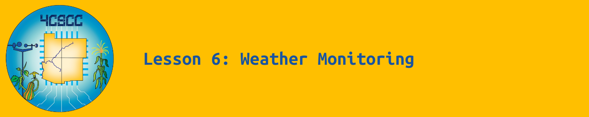

# Resources

## Sourcing Materials

| Item                                      | Description                                                  | Source                                                       |
| ----------------------------------------- | ------------------------------------------------------------ | ------------------------------------------------------------ |
| BBC micro:bit Development Board           | BBC micro:bit development board only.                        | [Parallax](https://www.parallax.com/product/microbit-v2-0-module/) [Adafruit](https://www.adafruit.com/product/4781) [DigiKey](https://www.digikey.com/en/products/detail/okdo/MICRO-BIT-SINGLE/22121539) [SparkFun](https://www.sparkfun.com/products/17287) |
| BBC micro:bit GO Bundle                   | BBC micro:bit development board with micro USB cable, AA battery pack, and 2 × AA Batteries. | [Parallax](https://www.parallax.com/product/microbit-2-0-go-bundle/) [Adafruit](https://www.adafruit.com/product/4834) [DigiKey](https://www.digikey.com/en/products/detail/okdo/MICRO-BIT-GO/22121532) [Mouser](https://www.mouser.com/ProductDetail/SparkFun/DEV-17288?qs=zW32dvEIR3vhPGlpo8dFog%3D%3D) [SparkFun](https://www.sparkfun.com/products/17288) |
| BBC micro:bit Club Bundle (10× GO Bundle) | 10 × BBC micro:bit GO Bundles (See description above.)       | [Parallax](https://www.parallax.com/product/microbit-v2-0-club-bundle/) [Adafruit](https://www.adafruit.com/product/4833) [SparkFun](https://www.sparkfun.com/products/17290) |
| SparkFun micro:climate kit for micro:bit  | The SparkFun micro:climate kit is a full weather station kit that is built on top of the weather:bit carrier board. | [SparkFun](https://www.sparkfun.com/products/16274) [DigiKey](https://www.digikey.com/en/products/detail/sparkfun-electronics/KIT-16274/11587352) [Mouser](https://mou.sr/3yCXhHc) [Chicago Electronic Distributors](https://chicagodist.com/products/sparkfun-micro-climate-kit-for-micro-bit-v3-0) [Electromaker](https://www.electromaker.io/shop/product/sparkfun-microclimate-kit-for-microbit-v30?srsltid=AfmBOoqEySRzn2dJ0IqjGn0WRGZk-rY4nxG3umnXYkhHnTleiurx-EQrzLI) |

## Documentation

The datasheet for the SparkFun micro:climate kit can be downloaded [here](https://mm.digikey.com/Volume0/opasdata/d220001/medias/docus/212/KIT-16274_Web.pdf).

The experiment guide can be viewed [here](https://learn.sparkfun.com/tutorials/microclimate-kit-experiment-guide).