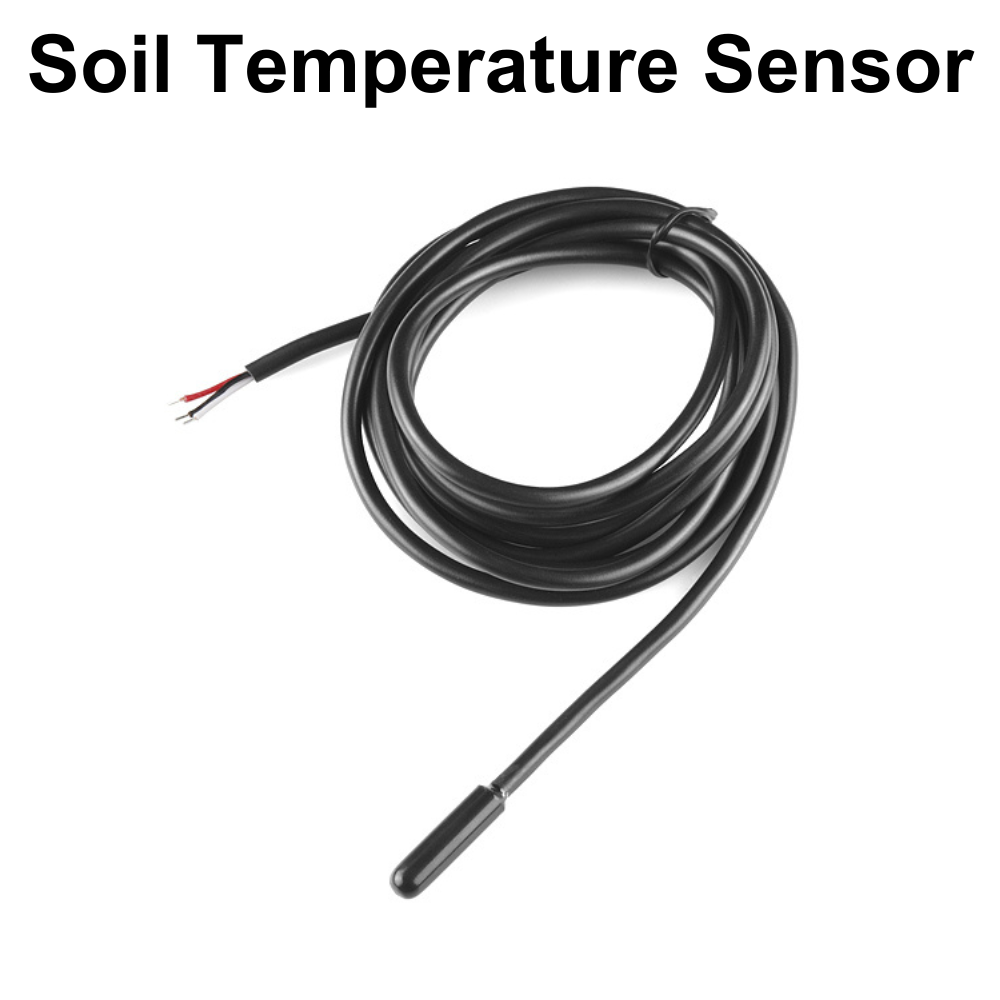
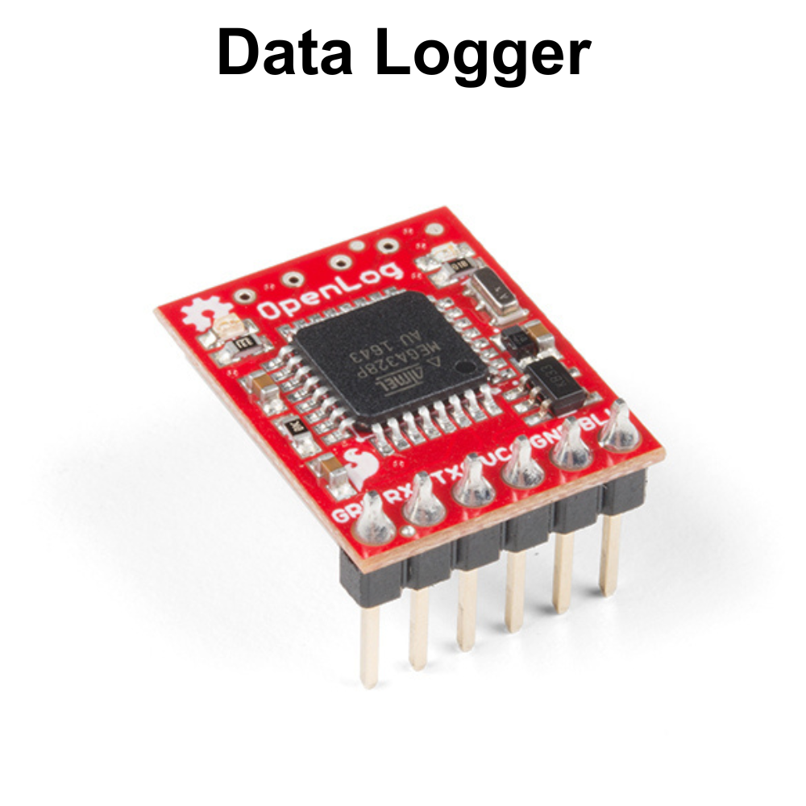
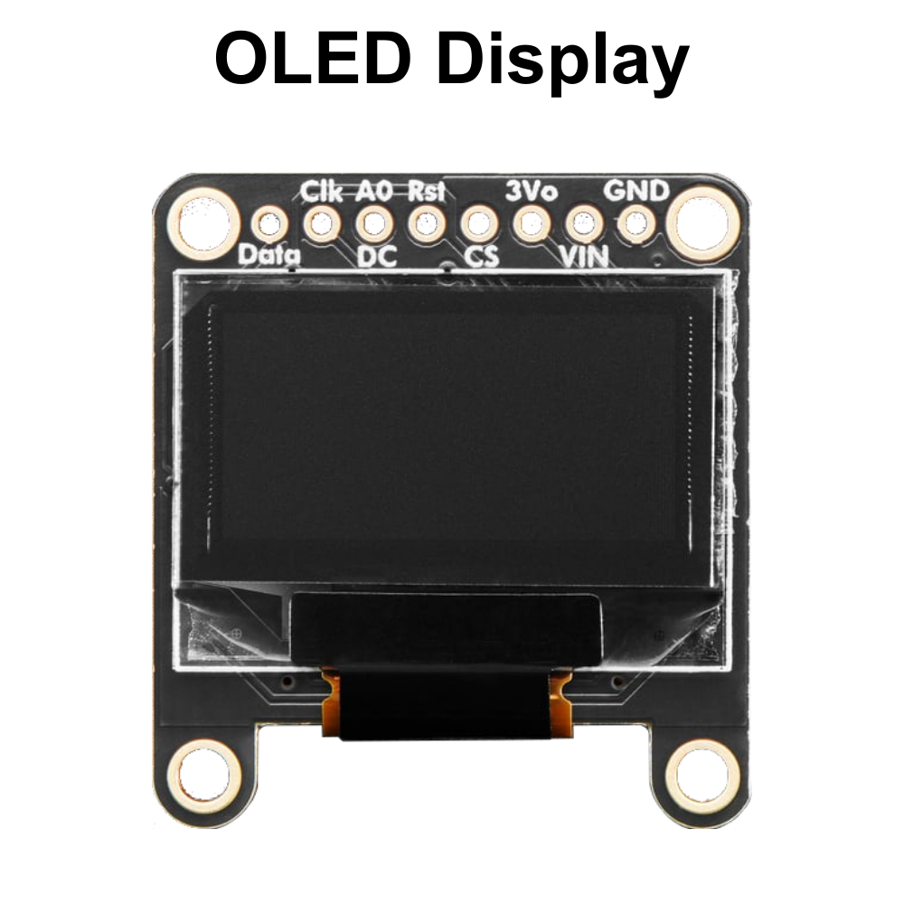

# Parts of the SparkFun weather:bit

## BME280

The SparkFun weather:bit board has a BME280 environmental sensor. The BME280 sensor is a small, advanced sensor that can measure temperature, humidity, and air pressure. It’s a tiny gadget that can fit in the palm of your hand, but it’s really powerful because it can give us accurate information about the environment around us. People use it in weather stations, smart homes, and even in phones to help predict the weather or make sure the conditions are just right for comfort. This sensor works by using special materials that respond to changes in temperature, humidity, and pressure, sending this data to a computer or another device, which can then display it in a way we can understand.

---

## Soil Moisture Sensor Port

---

## Soil Temperature Sensor Port

The DS18B20 sensor is a small device used to measure temperature. It’s about the size of a pencil eraser, but it can accurately tell you how hot or cold something is. This sensor is special because it can work over a wide range of temperatures, from really cold to really hot, and it can send the temperature information to a computer or another device. People use the DS18B20 in things like weather stations, cooking thermometers, and even in greenhouses to keep track of the temperature and make sure it’s just right. The sensor uses a digital signal, which means it sends the temperature as a number that devices can easily read and display.

---

## Wind Sensor Port

---

## Rain Sensor Port

---

## Serial Port

---

## I2C Port

